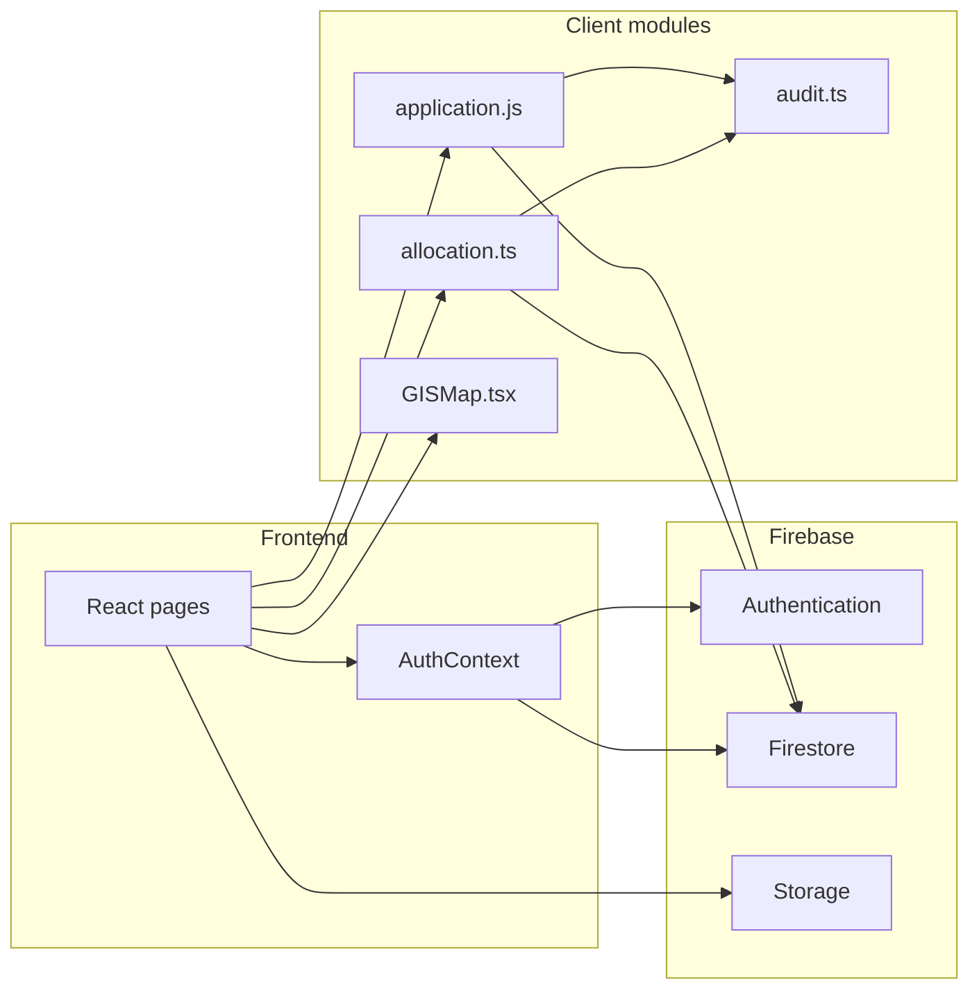

# Tulasetu — Legal Metrology Verification Portal

Digital verification, stamping, and public certificate lookup for weighing and measuring instruments — for businesses, Legal Metrology officers, administrators, and the public. **SIH 2026**, Problem Statement ID **26036**.

## Problem Statement

**PS ID 26036**, issued by the **Department of Consumer Affairs** (Ministry of Consumer Affairs, Food & Public Distribution).

Instrument verification under the Legal Metrology Act, 2009 is still largely manual: paper applications, physical stamps, and no easy way for a consumer or inspector to check whether a certificate is genuine or expired. Tulasetu records applications in Firestore, assigns officers, issues a certificate ID with a statutory expiry (12 or 24 months by instrument category), and lets anyone verify that ID from a QR URL or the public `/verify` page.

## Key Features

### Business
- Email/password signup and login (`users` profile with `role: business`).
- Submit a verification application (instrument, serial number, owner, address, district/state, map pin) to the `applications` collection.
- Client-side allocation after submit (`autoAllocateApplication`) when an eligible officer exists for that district.
- Live dashboard of own applications (`onSnapshot` on `ownerId`).
- View issued certificate and download a jsPDF copy.

### Officer
- Login as officer; inspection queue filtered by `assignedOfficerId`.
- GIS map of assigned applications plus a simple nearest-neighbour route polyline.
- Review page: approve (Pass) or reject (Fail) with remarks.
- Approval writes certificate fields onto the application **and** upserts `certificates/{certificateId}` so the public lookup is a direct `getDoc`.
- Re-approval of an already-approved application reuses the existing `certificateId` (no duplicate cert IDs).

### Admin
- Dashboard at `/admin/officer-verification` (client-side `role === 'admin'` check).
- Pending officer registrations: approve (creates `officers/{uid}`, sets `users.role` to `officer`) or reject.
- Officer workload table (`officers.workload`).
- Application map tab (Leaflet markers by status — not a density heatmap).

### Public
- No login required for `/verify`.
- Manual certificate ID entry, or auto-verify from `?id=<certificateId>` (QR uses this format).
- Shows Valid / Expired (expiry date vs today) / Revoked / Not Found.
- Navbar “Verify Certificate” is always visible.

## Tech Stack

Verified against `package.json` and actual `src/` imports. Unused listed dependencies are called out in [Known Limitations](#known-limitations--roadmap).

| Layer | Technology | Purpose |
| --- | --- | --- |
| UI | React 19, React DOM | SPA |
| Build | Vite 6 (`@vitejs/plugin-react`) | Dev server (port **3000**, host `0.0.0.0`) and production bundle |
| Language | TypeScript ~5.8 (`npm run lint` → `tsc --noEmit`) | Typecheck; some Firebase modules remain `.js` |
| Styling | Tailwind CSS 4 via `@tailwindcss/vite` | Utility CSS |
| Routing | `react-router-dom` 7 | Pages listed below |
| Auth / DB / files | Firebase JS SDK 12 (`auth`, `firestore`, `storage`, `analytics`) | Users, applications, certificates, officers, ID-card uploads |
| Maps | Leaflet, `react-leaflet`, `@turf/turf` | Pin picker, officer queue map, distance tie-break in allocation |
| Certificates | `qrcode.react`, `jspdf` | QR to `/verify?id=…`, A4 PDF export |
| Feedback | `react-hot-toast` | Approve/reject/allocation toasts |
| Icons | `lucide-react` | UI icons |

## Architecture Overview

The browser is the only app process. Firebase Auth + Firestore + Storage are the backend. Allocation, GIS helpers, certificate writes, and audit log inserts run **in the client** against Firestore.



**Firestore collections in use:** `users`, `applications`, `certificates`, `officers`, `officerRegistrations`, `auditLogs`. `officialOfficerRecords` is queried in `src/firebase/admin.ts` (`getOfficialRecord`) but no page calls it.

**Certificate data flow:** officer approve → update `applications/{appId}` + set `certificates/{CERT-LMxxxxxx}` → QR `/verify?id=CERT-LMxxxxxx` → `verifyCertificate` does `getDoc(certificates, id)`.

## Project Structure

```
.
├── index.html
├── package.json
├── vite.config.ts
├── tsconfig.json
├── metadata.json
├── src/
│   ├── main.tsx
│   ├── App.tsx                 # routes
│   ├── types.ts
│   ├── index.css
│   ├── constants/
│   │   └── legalMetrologyRules.js   # categories + calculateExpiryDate
│   ├── context/
│   │   └── AuthContext.tsx     # session only (onAuthStateChanged)
│   ├── firebase/
│   │   ├── config.js           # initializeApp; exports db, auth, storage
│   │   ├── auth.js
│   │   ├── application.js
│   │   ├── allocation.ts
│   │   ├── admin.ts
│   │   ├── officer.ts
│   │   └── audit.ts
│   ├── components/
│   │   ├── Navbar.tsx
│   │   └── GISMap.tsx
│   └── pages/
│       ├── LandingPage.tsx
│       ├── BusinessDashboard.tsx
│       ├── ApplyPage.tsx
│       ├── OfficerDashboard.tsx
│       ├── OfficerSignup.tsx
│       ├── ReviewPage.tsx
│       ├── CertificatePage.tsx
│       ├── VerifyPage.tsx
│       └── admin/
│           └── OfficerVerificationPage.tsx
```

Routes (`src/App.tsx`): `/`, `/business`, `/apply`, `/officer`, `/review/:id`, `/certificate/:id`, `/verify`, `/officer-signup`, `/admin/officer-verification`.

A screenshot of the landing dual-login cards, officer queue map, certificate + QR, and public verify result would help a reviewer more than extra prose (none are in the repo).

## Prerequisites

- Node.js 18+ and npm
- A Firebase project with Authentication (Email/Password), Cloud Firestore, and Storage

## Installation

```bash
git clone <your-repo-url>
cd legal-metrology-verification-portal
npm install
cp .env.example .env
```

Fill `.env` from the Firebase console, then start the app.

## Getting Started

**Prerequisites:** Node.js (npm). A Firebase project with Authentication (Email/Password), Cloud Firestore, and Storage enabled.

```bash
npm install
npm run dev
```

Dev server: **http://localhost:3000** (`vite --port=3000 --host=0.0.0.0`).

| Script | Command | What it does |
| --- | --- | --- |
| `npm run dev` | `vite --port=3000 --host=0.0.0.0` | Local app |
| `npm run build` | `vite build` | Production build to `dist/` |
| `npm run preview` | `vite preview` | Serve the build |
| `npm run lint` | `tsc --noEmit` | Typecheck only |
| `npm run clean` | `rm -rf dist server.js` | Unix-style delete (`server.js` is not produced by current Vite setup; this may fail in Windows PowerShell) |

**Firebase setup**

1. Create a Firebase web app, copy `.env.example` to `.env`, and fill in the `VITE_FIREBASE_*` values from Project settings.
2. Enable Email/Password in Authentication.
3. Create Firestore. You will likely need composite indexes for:
   - `applications`: `status` + `submittedAt`
   - `applications`: `ownerId` + `submittedAt`
   - `officers`: `jurisdiction.district` + `verificationStatus` + `available`
4. Enable Storage (officer ID cards under `officer-id-cards/{uid}/…`).
5. There is **no** `firestore.rules` (or Storage rules) file in this repo — configure rules in the Firebase console. Public verify needs **read** on `certificates/{id}`. Do not leave `applications` world-readable if you can avoid it.

**Promote a user to admin**

There is no in-app promote button. After the user exists in Auth and `users/{uid}`:

1. Firebase Console → Firestore → `users` → that UID.
2. Set field `role` to `"admin"` (string).
3. Log in from the landing page (either card). If `role === 'admin'`, the app navigates to `/admin/officer-verification`.

Officers who should appear in allocation need a document in `officers` (created when an admin **approves** a registration from `/officer-signup`), with `verificationStatus: "approved"`, `available: true`, and `jurisdiction.district` matching the application district.

## Environment-variable setup

These are **public Firebase web-app values** (the same object Firebase shows in Project settings → Your apps). They are not Admin SDK secrets. Vite **inlines** `import.meta.env.VITE_*` at **build** time — they will not appear at runtime unless they existed when `npm run build` ran.

Copy `.env.example` to `.env` locally:

```
VITE_FIREBASE_API_KEY=
VITE_FIREBASE_AUTH_DOMAIN=
VITE_FIREBASE_PROJECT_ID=
VITE_FIREBASE_STORAGE_BUCKET=
VITE_FIREBASE_MESSAGING_SENDER_ID=
VITE_FIREBASE_APP_ID=
VITE_FIREBASE_MEASUREMENT_ID=
```

`VITE_FIREBASE_MEASUREMENT_ID` is optional (Analytics). All others are required. `src/firebase/config.js` reads them as static `import.meta.env.VITE_*` identifiers so they survive production builds.

## Development command

```bash
npm run dev
```

App: http://localhost:3000

## Build command

```bash
npm run build
npm run preview
```

`npm run lint` runs `tsc --noEmit` (typecheck). There is no separate `typecheck` script.

## Vercel deployment

1. Import `https://github.com/akshatdevop-cyber/tulasetu`.
2. Framework Preset: **Vite**. Build: `npm run build`. Output: `dist`. Install: `npm install`.
3. In **Project Settings → Environment Variables**, add the `VITE_FIREBASE_*` names above. Enable **Production**, **Preview**, and **Development**.
4. Vercel may warn that `VITE_` variables are exposed to the browser. That is expected: Firebase web `apiKey` / `appId` are client configuration, not private Admin credentials. Do not put service-account JSON or Admin SDK keys here.
5. After saving variables, **Redeploy** (a new build). Changing env vars without rebuilding leaves the old empty values in the JS bundle.
6. `vercel.json` only sets SPA rewrites plus the Vite build/output commands. It does not store secrets.

Restrict the web API key by HTTP referrer in Google Cloud once the Vercel domain is known.

## User Roles & Access

Roles are stored on `users/{uid}.role` (`src/types.ts`: `business` | `officer` | `pending_officer` | `admin`).

| Role | Can do (as implemented) |
| --- | --- |
| `business` | Apply, own dashboard, view/download own certificates |
| `officer` | Assigned queue, review approve/reject, GIS + route, certificates |
| `admin` | Officer registration queue, workload, application map |
| `pending_officer` | Declared in types; **signup does not write this value** |
| Public (logged out) | `/verify` and landing; certificate lookup via `certificates` |

Navbar shows Business vs Officer links from `role`. Admin has no extra nav item — use `/admin/officer-verification` after login.

**Route guards:** only the admin page returns “Access Denied” if `role !== 'admin'`. `/business`, `/apply`, `/officer`, `/review/:id` are not wrapped in auth redirects.

## Known Limitations / Roadmap

- **Allocation runs in the browser** (`src/firebase/allocation.ts` documents this). Anyone who can call Firestore with the current rules can influence assignment. Move to a Cloud Function with Admin SDK.
- **Audit log** (`auditLogs`) is client `addDoc`; same trust issue. Typed actions include `certificate_revoked` / `officer_reassigned` but those flows are not implemented in `application.js`.
- **No Firestore/Storage rules in the repo.** Public verify depends on open (or at least unauthenticated) reads of `certificates`. Tighten `applications` / `users` / `officers`.
- **Landing “Sign up” as officer** writes `role: 'officer'` immediately (`auth.js` `signup`). `/officer-signup` (ID card + admin approval) is a separate route and is **not linked** from the landing page.
- **Allocation category filter** looks for `instrumentCategories` values `weighing_instruments` / `measuring_instruments` (set on admin approve). The apply form uses display keys such as `"Weighing Scale"` — category matching is effectively a no-op beyond district + available + approved.
- **Expiry / validity** is computed on approve from `INSTRUMENT_CATEGORIES` (24 months except `"Tank Lorry / Other"` = 12). Verify page treats `status === 'Revoked'` but nothing in the UI writes Revoked.
- **Admin “heatmap”** is colour-labelled markers, not a heatmap layer.
- **Unused npm packages** (present in `package.json`, not imported under `src/`): `@google/genai`, `express`, `dotenv`, `motion`, plus unused tooling `tsx` / `esbuild` as direct deps. `@types/express` is unused.
- **`getOfficialRecord`** / `officialOfficerRecords` unused by pages.
- **Windows:** `npm run clean` uses `rm`.
- **Demo assets:** no screenshots, GIF, or live demo URL in the repo.

## Team / contributors

**The Calibration Crew** — SIH 2026

| Name | Role |
| --- | --- |
| [Name] | [Role] |
| [Name] | [Role] |
| [Name] | [Role] |
| [Name] | [Role] |
